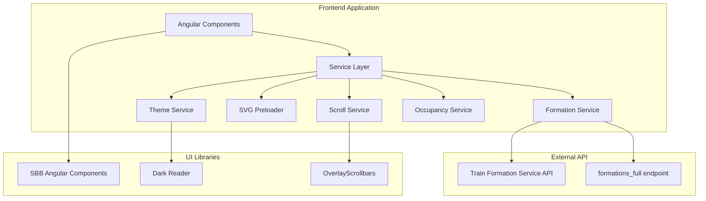

<a id="readme-top"></a>

# [SKI+](https://opentransportdata.swiss/en/about-us/) | Swiss Train Formation Visualization

<div align="center">
  <a href="https://opentdatach.github.io/train-formation-view/">
    
  </a>

  <p align="center">
    An Angular-based frontend to visualize train formations in the Swiss public transport system
    <br />
    <a href="https://opentdatach.github.io/train-formation-view/"><strong>View Live Demo »</strong></a>
    <br />
    <br />
    <a href="https://api-manager.opentransportdata.swiss/portal/catalogue-products/tedp_formation_service_api-1">Explore API</a>
    ·
    <a href="https://github.com/openTdataCH/train-formation-view/issues">Report Bug</a>
    ·
    <a href="https://github.com/openTdataCH/train-formation-view/issues">Request Feature</a>
  </p>
</div>

<details>
  <summary><strong>ToC</strong></summary>
  <ol>
    <li><a href="#about-the-project">About The Project</a></li>
    <li><a href="#built-with">Built With</a></li>
    <li><a href="#getting-started">Getting Started</a></li>
    <li><a href="#system-architecture">System Architecture</a></li>
    <li><a href="#features">Features</a></li>
    <li><a href="#api-configuration">API Configuration</a></li>
    <li><a href="#deployment">Deployment</a></li>
    <li><a href="#contributing">Contributing</a></li>
    <li><a href="#license">License</a></li>
    <li><a href="#acknowledgments">Acknowledgments</a></li>
  </ol>
</details>

## About The Project

This frontend serves as an exploratory prototype demonstrating practical applications for the [formation data - full API endpoint](https://api.opentransportdata.swiss/formation/v1/formations_full) from Open Transport Data Switzerland. The application utilizes the separately licensed [train-view-svg-library](https://github.com/openTdataCH/train-view-svg-library) (CC BY 4.0) to render detailed train visualizations.

The visualization helps passengers locate specific coaches, identify where low-floor entry points are available, and understand the overall formation of trains at different stops along a route. Rather than static timetable information, this tool provides dynamic insights into the actual composition and layout of Swiss trains throughout their journeys.

<p align="right">(<a href="#readme-top">back to top</a>)</p>

## Built With

[![Angular][Angular.io]][Angular-url]
[![TypeScript][TypeScript]][TypeScript-url]
[![RxJS][RxJS]][RxJS-url]

<details>
  <summary><strong>Technical Details</strong></summary>

**Core Framework & Language**

- Angular 19.2.9 with standalone components architecture
- TypeScript 5.7.x for type safety
- RxJS for reactive programming patterns and API data streams

**UI & Design System**

- [SBB Angular Component Library 19.1.6](https://angular.app.sbb.ch/) providing modern Angular components & styles
- Custom SCSS styling with responsive design principles
- [Dark Reader](https://www.npmjs.com/package/darkreader) library for automatic dark mode support
- [OverlayScrollbars](https://kingsora.github.io/OverlayScrollbars/) library for consistent scrollbars across platforms

**Development & Deployment**

- Angular CLI for build tooling and development server
- ESLint with Angular-specific rules for code quality
- GitHub Actions for continuous integration and automated deployment
- GitHub Pages for static hosting

</details>

<p align="right">(<a href="#readme-top">back to top</a>)</p>

## Getting Started

The application can be run locally for development or deployed as a static web application. Both scenarios require an API key from OpenTransportData.swiss.

### Prerequisites

Ensure you have Node.js 18 or higher installed on your system:

```bash
node --version  # Should be 18.x or higher
npm --version   # Comes bundled with Node.js
```

### Installation

1. **Clone the repository**

   ```bash
   git clone https://github.com/openTdataCH/train-formation-view.git
   cd train-formation-view
   ```

2. **Install dependencies**

   ```bash
   npm install
   ```

3. **Configure API access** - Register at [OpenTransportData.swiss API Manager](https://api-manager.opentransportdata.swiss/), subscribe to the "Train Formation Service" API, and generate your API key

4. **Set up local environment file** - Replace `your-api-key-goes-here` with your actual API key from step 3

   ```bash
   cat > src/environments/environment.local.ts << 'EOF'
    /**
      * Local development environment configuration
      * IMPORTANT: This file should not be committed to version control.
      * Add this file to .gitignore to prevent accidental exposure of API keys.
      */
    export const environment = {
        /** Whether the app is running in production mode */
        production: false,
        /**
        * API key for the OpenTransportData Train Formation Servive API
        * For security reasons, consider moving this to a secure environment variable
        * or authentication service in production environments.
        */
        apiKey: 'your-api-key-goes-here'
      };
   EOF
   ```

5. **Start development server**
   ```bash
   ng serve
   ```

The application will be available at `http://localhost:4200` with hot reload for development.

<p align="right">(<a href="#readme-top">back to top</a>)</p>

## System Architecture

The application follows a reactive architecture pattern with clear separation of concerns:



**Data Flow**: User interactions trigger Angular services that fetch formation data from the OpenTransportData API while occupancy information is pre-fetched daily via GitHub Actions and served statically.

<p align="right">(<a href="#readme-top">back to top</a>)</p>

## Features

### Search & Discovery

Interactive search interface supporting train number lookup with operator selection (SBB, BLS, etc.) and date selection for future formation data.

### Formation Visualization

Detailed train composition display showing coach classes (1st/2nd class), specialized vehicles (restaurant cars, sleeper carriages, family zones), onboard amenities (bicycle storage, wheelchair accessibility, low-floor entry points), and coach numbering with sector information.

### Dynamic Route Display

Stop-by-stop formation changes throughout the journey, allowing users to see how train composition evolves at different stations along the route.

### Accessibility & User Experience

Responsive design optimized for both desktop and mobile devices, integrated dark mode support, and smooth scrolling with custom overlay scrollbars for consistency across different environments.

<p align="right">(<a href="#readme-top">back to top</a>)</p>

## API Configuration

The application requires access to the OpenTransportData.swiss Formation Service API. Authentication is handled through API keys with different configurations for development and production environments.

**Development Setup**:
Create a `.env` file in your project root containing your API key. The development server will automatically inject this into the Angular environment configuration.

**Production Deployment**:
API keys are managed through GitHub Secrets and automatically replaced during the build process. The deployment workflow handles this substitution automatically without exposing sensitive credentials.

**Rate Limiting**: The OpenTransportData API implements standard rate limiting (5x API calls per minute).

<p align="right">(<a href="#readme-top">back to top</a>)</p>

## Deployment

The application uses GitHub Actions for automated deployment to GitHub Pages with additional data synchronization for occupancy information.

### Automated Pipeline

The deployment process includes two main workflows:

**Daily Data Sync**: Automatically fetches and processes occupancy forecast data from OpenTransportData.swiss, maintaining a rolling 4-day window of occupancy information updated daily at 01:00 UTC.

**Build & Deploy**: Triggered on main branch pushes, this workflow builds the Angular application for production, injects API credentials from GitHub Secrets, and deploys the static build to GitHub Pages.

### Manual Deployment

For custom deployments or different hosting platforms:

```bash
# Build for production
npm run build -- --base-href=/your-path/

# Serve statically
# The dist/train-view/browser directory contains all necessary files
```

<p align="right">(<a href="#readme-top">back to top</a>)</p>

## Contributing

Technical contributions are welcome and appreciated. The codebase follows Angular practices with standalone components.

**Development Workflow**:
Fork the repository, create a feature branch with descriptive naming (`feature/enhanced-search-filters`), implement your changes following the existing code style and patterns, ensure linting rules are satisfied, then submit a pull request with clear description of changes and motivation.

**Code Standards**: The project uses ESLint with Angular-specific rules and TypeScript strict mode for type safety.

<p align="right">(<a href="#readme-top">back to top</a>)</p>

## License

Distributed under the MIT License. See `LICENSE` file for complete terms and conditions.

<p align="right">(<a href="#readme-top">back to top</a>)</p>

## Acknowledgments

This project builds upon excellent work from the Swiss public transport ecosystem and open source community:

- **[OpenTransportData.swiss](https://opentransportdata.swiss/)** for providing public transport APIs and formation data
- **[SBB Angular Component Library](https://angular.app.sbb.ch/)** for Angular components
- **[GitHub Pages](https://pages.github.com/)** for static hosting
- **[GitHub Actions](https://github.com/features/actions)** for automated CI/CD pipeline and data synchronization
- **[Dark Reader](https://darkreader.org/)** for dark mode implementation across web applications
- **[OverlayScrollbars](https://kingsora.github.io/OverlayScrollbars/)** for consistent scrollbars across platforms

<p align="right">(<a href="#readme-top">back to top</a>)</p>

<!-- MARKDOWN LINKS & IMAGES -->

[Angular.io]: https://img.shields.io/badge/Angular-DD0031?style=for-the-badge&logo=angular&logoColor=white
[Angular-url]: https://angular.io/
[TypeScript]: https://img.shields.io/badge/TypeScript-007ACC?style=for-the-badge&logo=typescript&logoColor=white
[TypeScript-url]: https://www.typescriptlang.org/
[RxJS]: https://img.shields.io/badge/RxJS-B7178C?style=for-the-badge&logo=reactivex&logoColor=white
[RxJS-url]: https://rxjs.dev/
